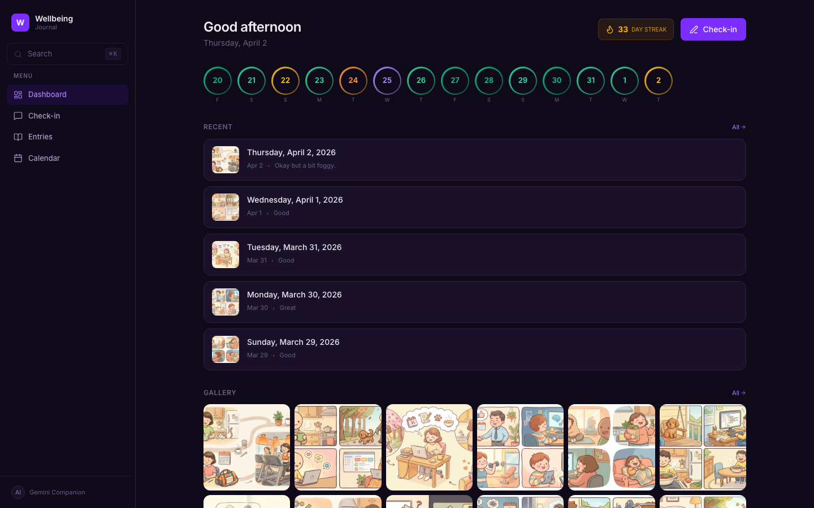
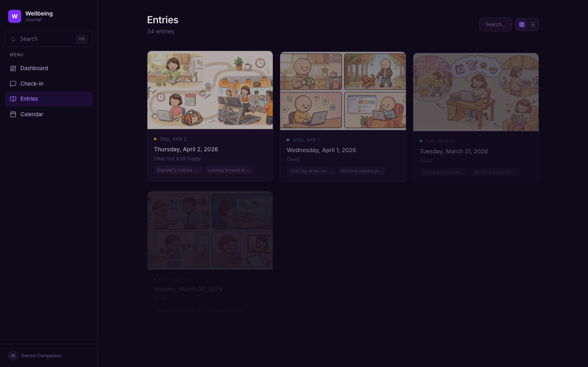
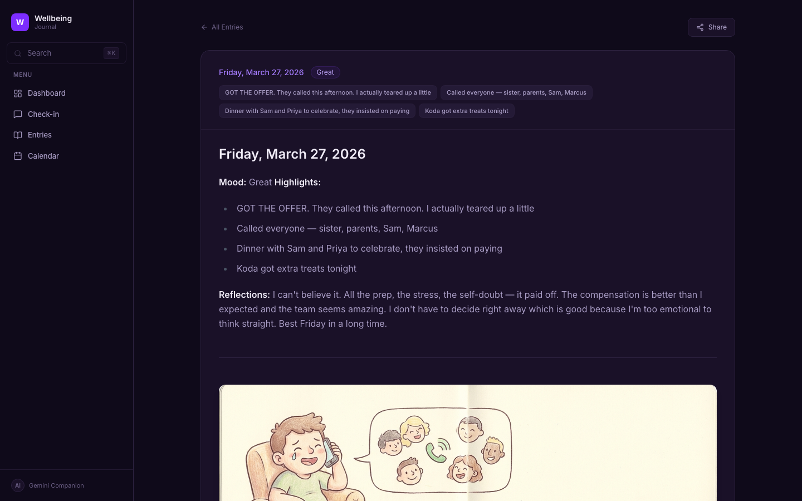
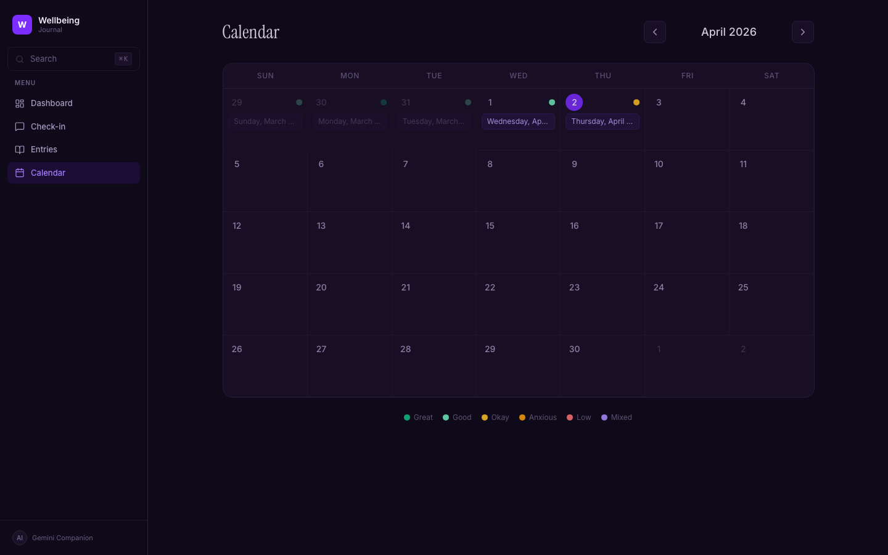
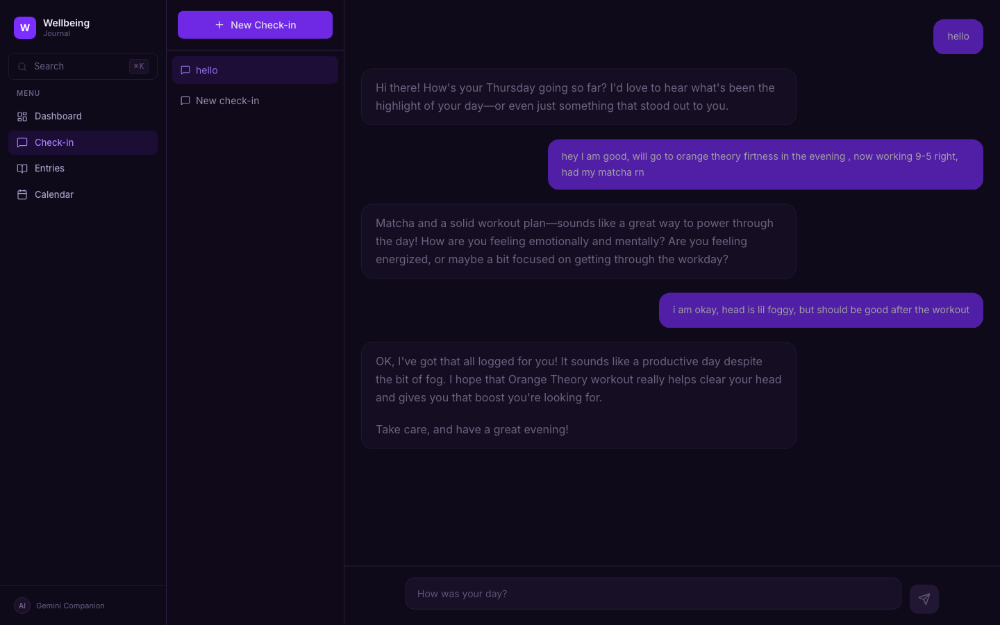

# Wellbeing Agent

A personal AI companion that checks in on your day, journals it, and draws a cartoon of your highlights. Built over a weekend because I wanted something more personal than a notes app.



## What it does

You chat with the agent about your day — what happened, how you're feeling. It asks a couple of follow-up questions (like a friend, not a therapist), then saves a structured journal entry and generates a cute cartoon illustration of your highlights using Gemini.

Over time you build up a collection of daily entries you can browse, search, and share.

**The search is the cool part** — it uses FAISS vector search with sentence embeddings, so searching "green tea" will match entries where you talked about matcha. It understands meaning, not just keywords.

## Screenshots

| Entries | Journal Entry |
|---------|--------------|
|  |  |

| Calendar | Chat |
|----------|------|
|  |  |

## Features

- **AI check-in chat** — conversational daily journaling powered by Gemini via Google ADK
- **Auto-generated cartoons** — each entry gets a cartoon illustration of your day
- **Semantic search** — FAISS + sentence-transformers, so "feeling stressed" finds entries about anxiety too
- **Mood tracking** — color-coded mood rings on the dashboard, streak counter
- **Calendar view** — month view with mood indicators and entry previews
- **Share cards** — generates a nice image card from any entry, ready for stories/social
- **Keyboard shortcuts** — Cmd+K to search, arrow keys to navigate between entries

## Tech stack

- **Agent**: [Google ADK](https://google.github.io/adk-docs/) with Gemini 3 Flash
- **Image generation**: Gemini 3 Pro (image preview)
- **Search**: FAISS + all-MiniLM-L6-v2 sentence embeddings
- **Backend**: FastAPI + Uvicorn
- **Frontend**: React 19, Vite 8, Tailwind CSS 4, Framer Motion, Recharts
- **Data**: Markdown files (no database needed for journals)

## Getting started

### Prerequisites

- Python 3.12+
- Node.js 22+
- [uv](https://docs.astral.sh/uv/) (Python package manager)
- A [Google AI Studio](https://aistudio.google.com/) API key

### Setup

```bash
# Clone the repo
git clone https://github.com/jas1thi/wellbeing-agent.git
cd wellbeing-agent

# Set up environment
cp .env.example .env
# Edit .env and add your GEMINI_API_KEY

# Install Python dependencies
uv sync

# Install frontend dependencies
cd journal-app && npm install --legacy-peer-deps && cd ..
```

### Running

You need two terminals:

```bash
# Terminal 1 — Backend (agent + API)
uv run python main.py
```

```bash
# Terminal 2 — Frontend
cd journal-app && npm run dev
```

Open [http://localhost:5173](http://localhost:5173)

The backend runs on port 8000 (agent chat + search API), and the frontend on port 5173 with Vite proxying API requests.

### Docker

```bash
docker build -t wellbeing-agent .
docker run -p 8000:8000 --env-file .env wellbeing-agent
```

## How it works

1. **Chat** — You talk to the agent through the Check-in page. It's a Gemini-powered conversational agent built with Google ADK that asks about your day.

2. **Journal** — After 2-3 exchanges, the agent calls `save_journal` to create a markdown file with your mood, highlights, and reflections. It also calls Gemini's image generation to create a cartoon.

3. **Search** — When you search, your query gets embedded with the same sentence-transformer model used to index all journal chunks. FAISS finds the closest matches by cosine similarity.

4. **Frontend** — The React app reads journal files through a Vite dev server plugin (dev) or FastAPI static routes (production). No database needed for the journal content — it's all markdown files and PNG images.

## Project structure

```
wellbeing-agent/
├── main.py                    # Entry point — FastAPI + ADK
├── wellbeing_agent/
│   ├── agent.py               # Agent definition + prompt
│   ├── api.py                 # REST API routes
│   └── tools/
│       ├── journal_store.py   # Save/read/search journals (FAISS)
│       └── image_gen.py       # Gemini cartoon generation
├── journal-app/               # React frontend
│   ├── src/
│   │   ├── pages/             # Dashboard, Entries, Journal, Calendar, Chat
│   │   ├── components/        # Sidebar, SearchModal, SharePreview, etc.
│   │   ├── hooks/             # useJournals, useStats, useSearch
│   │   └── lib/               # API client, share card generator
│   └── vite.config.js         # Dev server + API plugin
├── journals/                  # Markdown entries + cartoon PNGs
└── Dockerfile
```

## License

Do whatever you want with it. If you build something cool on top of this, I'd love to hear about it.
