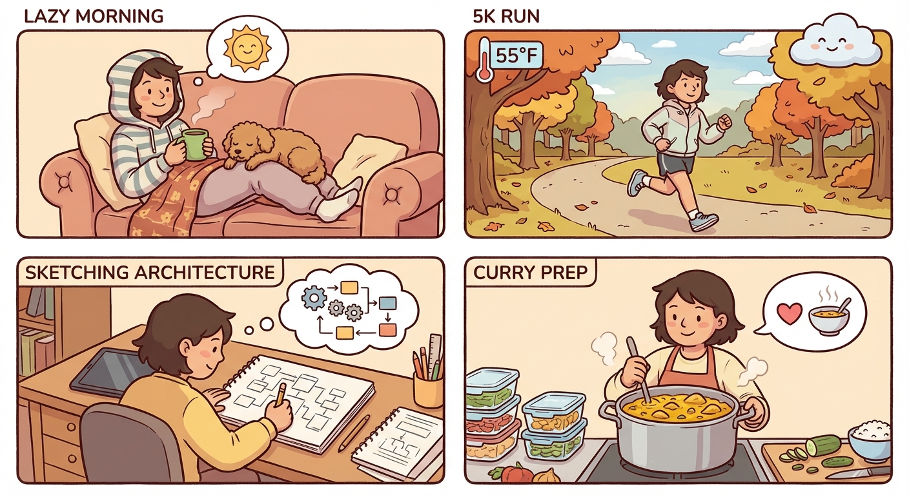

# Sunday, March 1, 2026

**Mood:** Good
**Highlights:**
- Lazy morning with matcha and Koda on the couch
- Went for a 5k run in the park — weather was perfect, mid-50s
- Spent a couple hours sketching out the architecture for the agent orchestration layer
- Made a big batch of chicken curry for the week

**Reflections:**
Starting March with some good energy. The agent project is starting to take shape in my head and I'm excited to actually build it out this week. Koda kept trying to steal bites of chicken while I was cooking.

---

