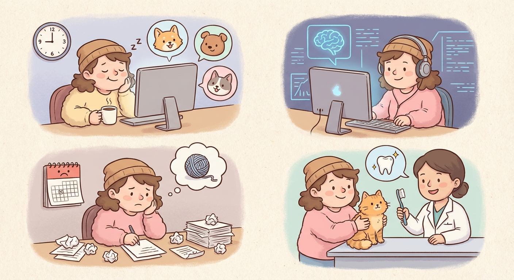

# Wednesday, March 4, 2026

**Mood:** Mixed
**Highlights:**
- Long meetings most of the morning, not much deep work time
- Worked on the agent memory system in the evening — got basic vector storage working
- Koda had a vet checkup, he's healthy but needs his teeth cleaned

**Reflections:**
Days with too many meetings leave me drained. I barely wrote any code during work hours. At least the evening agent session was productive — the memory system is starting to come together. Vet bill was steeper than expected though.

---

