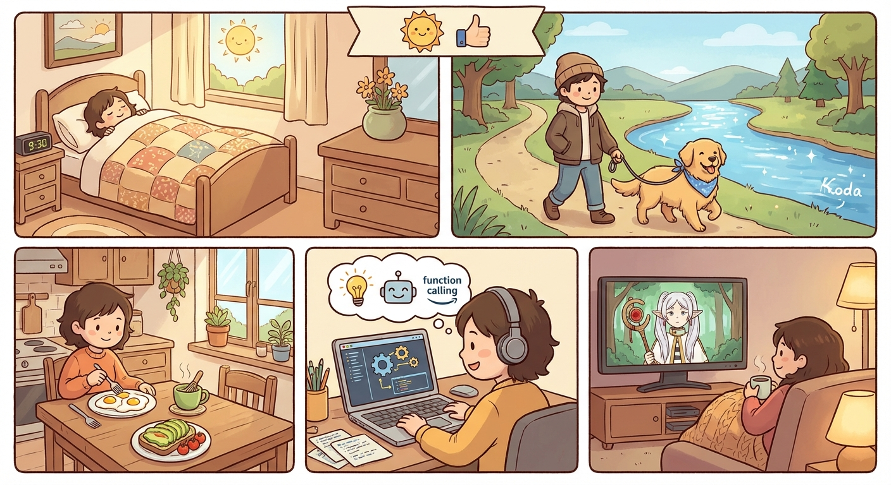

# Saturday, March 7, 2026

**Mood:** Good
**Highlights:**
- Slept in until 9:30, made a proper breakfast — eggs, avocado toast, matcha
- Long walk with Koda along the river trail
- Deep work session on the agent tool-use pipeline, got function calling working reliably
- Watched a few episodes of Frieren in the evening

**Reflections:**
Saturdays where I can just code on my own stuff with no pressure are the best. The tool-use pipeline is the core of the whole agent system and seeing it work end-to-end was a real moment. Frieren continues to be quietly beautiful.

---

