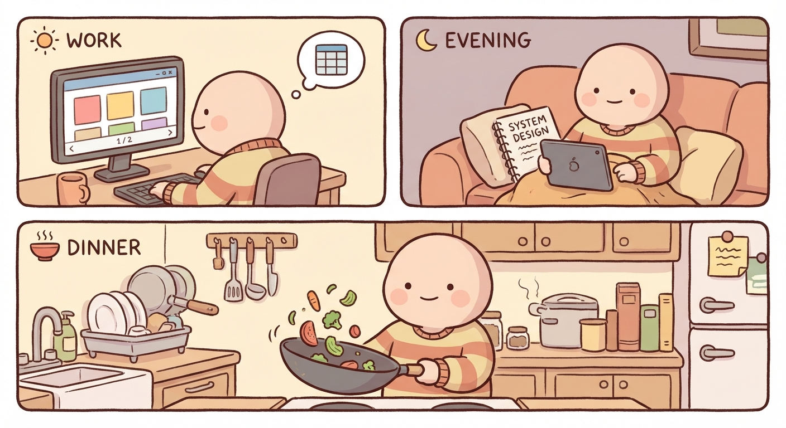

# Monday, March 9, 2026

**Mood:** Okay
**Highlights:**
- Worked on pagination for the dashboard at work
- Started doing interview prep in the evenings — system design practice
- Made a simple stir fry for dinner, nothing fancy

**Reflections:**
Trying to balance work, interview prep, and the side project is a lot. I decided to pause the agent project this week so I can focus on prep without feeling guilty. One thing at a time.

---

