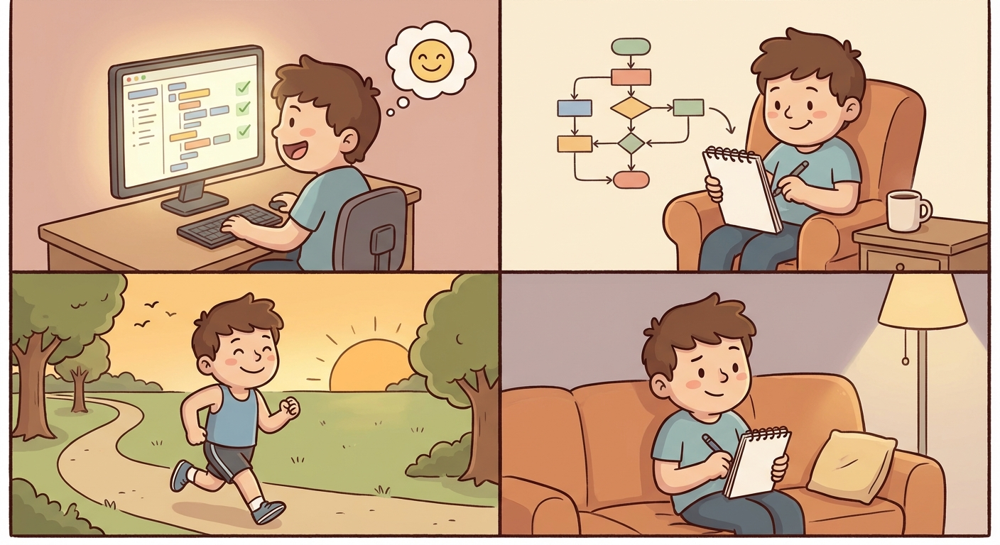

# Thursday, March 12, 2026

**Mood:** Good
**Highlights:**
- Addressed all the code review feedback, the API design is genuinely better now
- Ran 3 miles after work, felt like exactly what I needed
- Did another hour of interview prep — behavioral questions this time

**Reflections:**
Feeling better today. Turns out the reviewer was right about the endpoint structure and reworking it taught me something. Running always resets my brain. Four more days until the interview.

---

