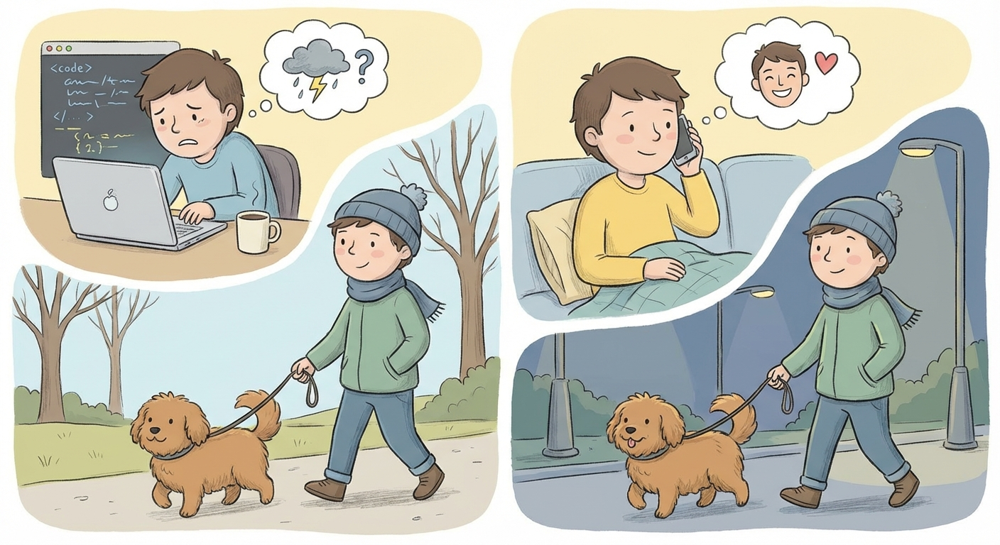

# Saturday, March 14, 2026

**Mood:** Anxious
**Highlights:**
- Full day of interview prep — went through 10 LeetCode mediums
- Walked Koda twice to break up the study sessions
- Called my sister, she gave me a good pep talk

**Reflections:**
Two days out from the interview and I can feel the nerves building. I know I've prepared well but my brain keeps inventing worst-case scenarios. My sister reminded me that I've been doing this work for years and I actually know my stuff. Trying to hold onto that.

---

