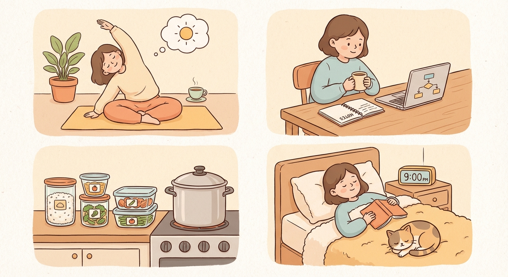

# Sunday, March 15, 2026

**Mood:** Okay
**Highlights:**
- Light review of system design notes, didn't want to overdo it
- Yoga in the morning to calm the nerves
- Meal prepped for the week — kept it simple with rice bowls
- Early bed, interview is tomorrow afternoon

**Reflections:**
Trying to trust the preparation and just rest. I've done what I can. Whatever happens tomorrow, it's not the end of the world. Koda is sleeping at my feet and that's grounding.

---

---

