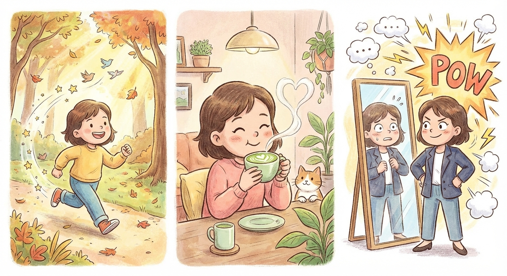

# Wellbeing Journal - March 16, 2026

**Mood:** Good, but a bit nervous.
**Highlights:**
- Started the day with matcha.
- Went for a morning run.
- Had a big interview I've been preparing for.

**Reflections:**
It felt great to stick to a morning routine with matcha and a run. I've put a lot of work into preparing for today's interview, so the nerves are definitely there, but overall I'm feeling positive about the effort I've put in.

