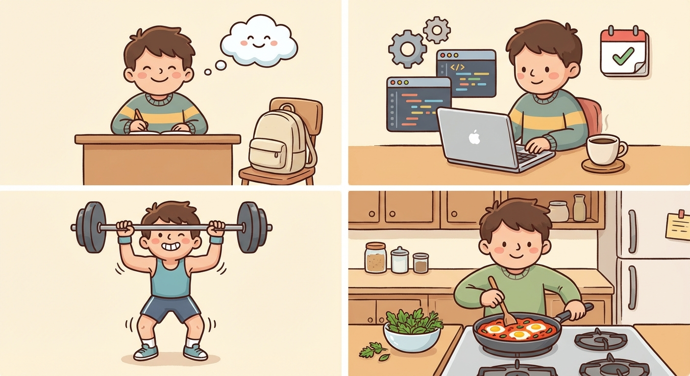

# Wednesday, March 18, 2026

**Mood:** Good
**Highlights:**
- Back to work feeling lighter — the interview weight is off my shoulders
- Picked up the agent project again, refactored the memory module
- Gym after work, legs day, absolutely destroyed my quads
- Made a quick shakshuka for dinner

**Reflections:**
It's nice to have brain space again now that the interview is done. I forgot how much I missed working on the agent project. The memory module needed a rethink and I'm glad I stepped away — came back with much clearer ideas.

---

---

