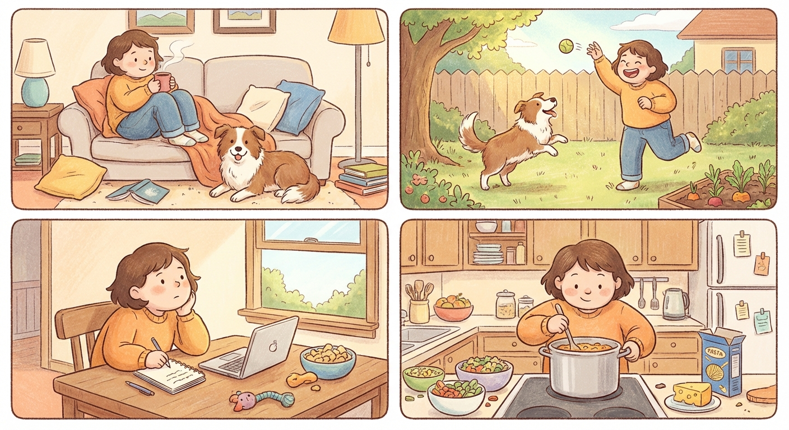

# Sunday, March 22, 2026

**Mood:** Okay
**Highlights:**
- Lazy day, didn't do much productive
- Played with Koda in the backyard for a while
- Some interview prep for the final round but kept getting distracted
- Made pasta with whatever was left in the fridge

**Reflections:**
Not every day has to be a 10. I think my body needed the rest even if my brain felt guilty about it. The fridge pasta was actually decent — garlic, cherry tomatoes, and whatever cheese I had. Sometimes simple is fine.

---

---

