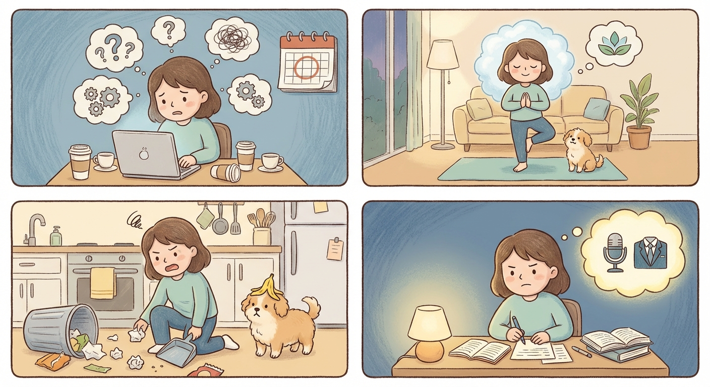

# Tuesday, March 24, 2026

**Mood:** Anxious
**Highlights:**
- Final round interview is tomorrow, spent the evening doing last prep
- Work was fine, mostly code reviews and a small bug fix
- Yoga in the evening to try to calm down
- Koda somehow got into the trash, had to clean up a mess

**Reflections:**
Nerves are back in full force. I keep telling myself I've prepared enough. The yoga helped physically but my mind is still racing. Koda's trash adventure was actually a welcome distraction — hard to be anxious when you're chasing a dog with a chicken bone.

---

---

