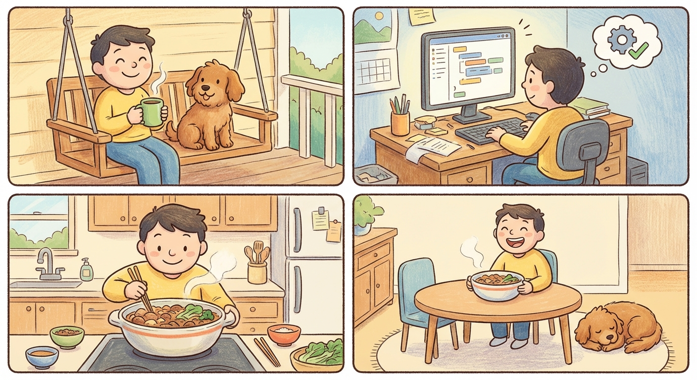

# Saturday, March 28, 2026

**Mood:** Great
**Highlights:**
- Still riding the high from yesterday
- Long morning with matcha and Koda, just sat on the porch and felt grateful
- Deep work on the agent — added a reflection step where it evaluates its own output before returning
- Made Korean beef bowls again because they're that good

**Reflections:**
I feel lighter than I have in weeks. With the career stress lifted, I'm coding with pure joy again. The self-evaluation step is making the agent noticeably better — it catches its own mistakes about 70% of the time now. That's the kind of thing that could be a real differentiator.

---

---

