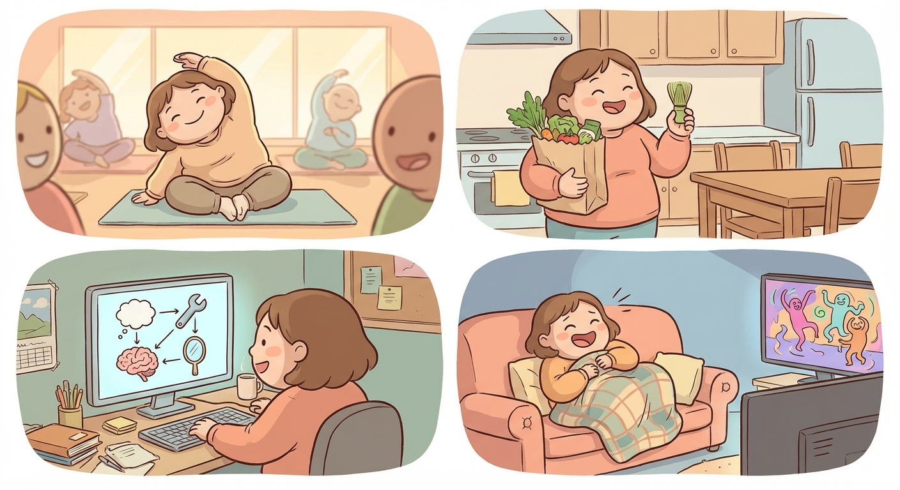

# Sunday, March 29, 2026

**Mood:** Good
**Highlights:**
- Morning yoga, finally tried a class in person instead of YouTube — loved it
- Grocery run, stocked up on proper matcha and cooking supplies
- Agent project: the whole pipeline works end-to-end now — planning, tool use, memory, self-evaluation
- Binged the rest of Dandadan season, what a ride

**Reflections:**
The in-person yoga class was a different experience entirely. I should go more often. The agent pipeline working fully is a quiet milestone — no fanfare, just me and Koda in the apartment, but I know this is something real. Need to write it up and maybe share a demo.

---

---

