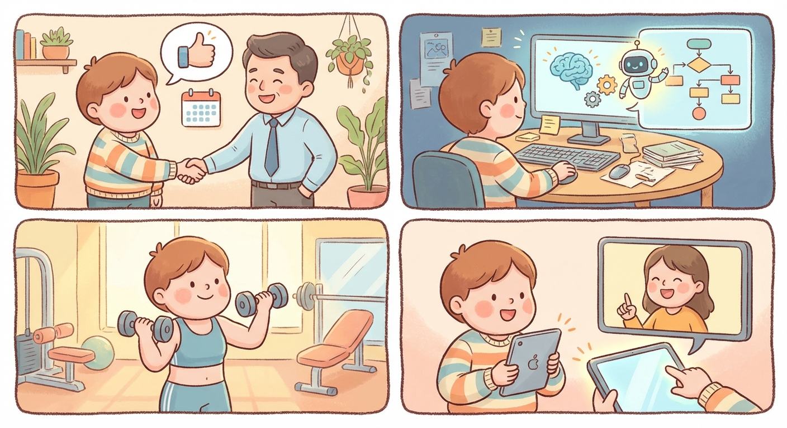

# Monday, March 30, 2026

**Mood:** Great
**Highlights:**
- Gave my two weeks notice at work — manager was supportive and understanding
- The agent project breakthrough: got it to autonomously complete a multi-step research task with zero hand-holding
- Gym session felt effortless, everything is clicking right now
- Video called Marcus to show him the agent demo, he was genuinely impressed

**Reflections:**
Handing in my notice was scary but freeing. My manager said he saw it coming and wished me well. And the agent completing a real task on its own — planning which tools to use, recovering from errors, synthesizing results — that's the moment I've been building toward. Marcus said "this is actually good" which from him is the highest praise.

---

---

