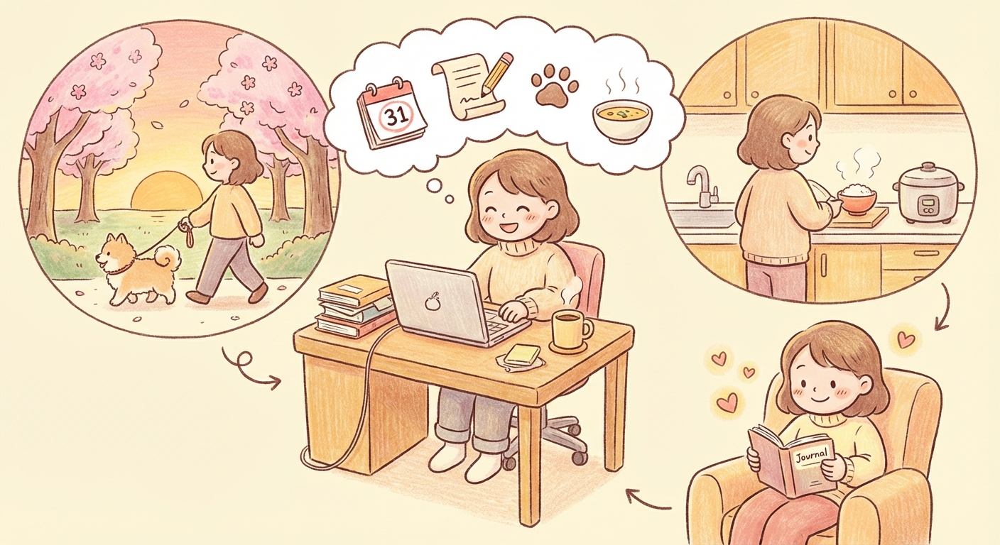

# Tuesday, March 31, 2026

**Mood:** Good
**Highlights:**
- Last day of March, reflected on how much happened this month
- Wrote up a technical blog post draft about the agent architecture
- Took Koda for a sunset walk, the cherry blossoms are starting to bloom
- Made miso soup and rice, kept it simple

**Reflections:**
What a month. Started it anxious about career stuff, ended it with a new job offer and an agent project that actually works. I'm proud of myself for pushing through the hard days instead of shutting down. April is going to be about transitions — wrapping up at work, prepping for the new role, and maybe open-sourcing the agent. Koda and the cherry blossoms were a perfect way to close out March.

---

---

